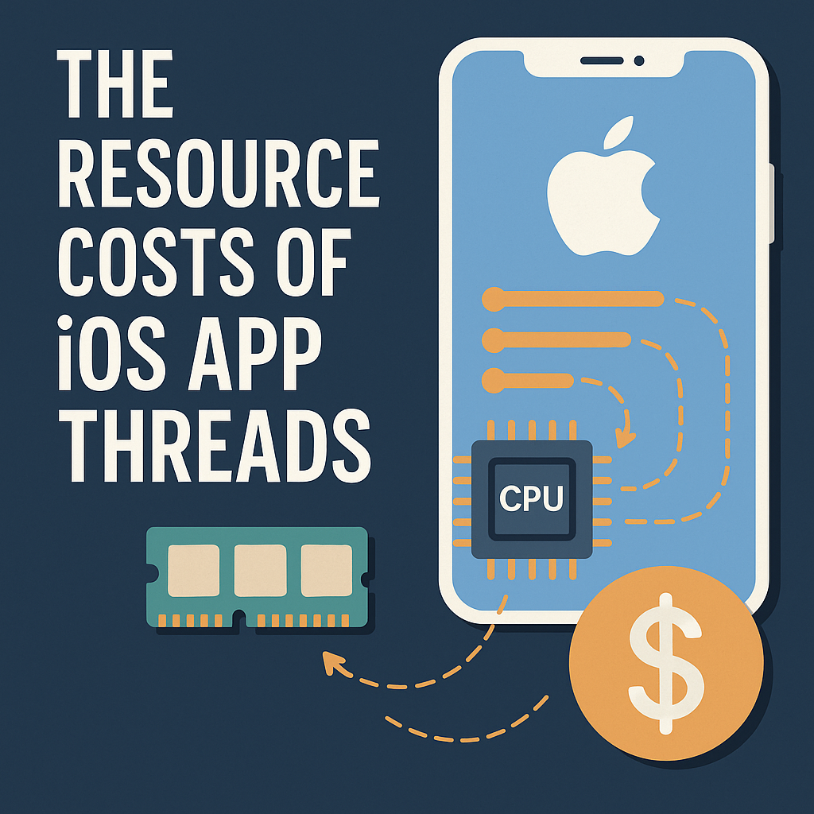

## The Cost of Threads
Often an iOS app would be running multiple threads in a process. Sometimes these threads are used to do some local computations or downloading content from the internet. We often create a background thread whenever we are doing any computation or downloading task which can be run in the background. But we often ignore the cost of creating threads.

Nowadays all the devices come up with at least 3 to 4 cores, which makes our processor execute more than one task at a moment. But utilizing these cores comes with the cost of creating and maintaining them. It impacts app performance too!

Each thread not only takes some time during creation but also uses up memory in the kernel as well as the app’s memory space.

## Kernel Data Structures

Each thread consumes almost 1KB of memory in kernel space. This memory is used to store data structures and attributes pertaining to the thread. This is wired memory and cannot be paged.

## Stack Size

The main thread stack size is 1 MB and cannot be changed. Any other thread is allocated 512 KB of stack space by default. Note that the full stack is not immediately created. The actual stack size grows with use. So, even if the main thread has a stack size of 1 MB, at some point in time, the actual stack size may be much smaller.

Before a thread starts, the stack size can be changed. The minimum allowed stack size is 16 KB, and the size must be a multiple of 4 KB. The sample code below shows how you can configure the stack size before starting a thread.

```objc
+(NSThread *)createThreadWithTarget:(id)target 
                            selector:(SEL)selector 
                              object:(id)argument 
                           stackSize:(NSUInteger)size {
    if ((size % 4096) != 0) {
        return nil;
    }
    NSThread *t = [[NSThread alloc] initWithTarget:target
                                          selector:selector
                                            object:argument];
    t.stackSize = size;

    return t;
}
```

## Thread’s Creation Time

The time taken to actually start a thread after creation ranged from anywhere between 5 ms to well over 100 ms, averaging about 29 ms. That can be a lot of time, especially if you start multiple threads during app launch.

The elongated time for thread start can be attributed to several context switches that have overheads!

Thank You! 😊😊😊